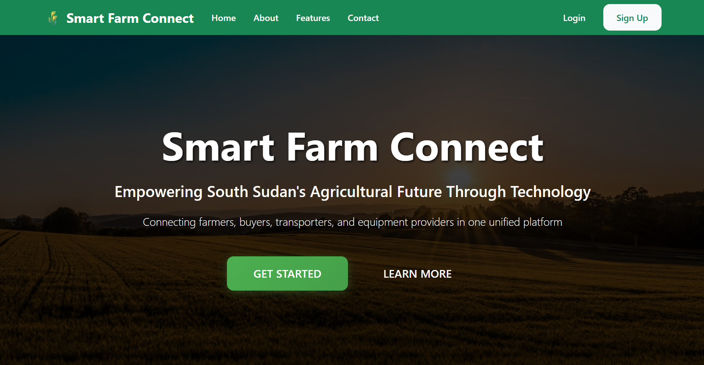

# Smart Farm Advisory And Agricultural Products Management System (APMS) For South Sudan

A comprehensive platform designed to revolutionize South Sudan's agricultural ecosystem by bridging the gap between Farmers, Buyers, Transporters, and Equipment Sellers. The system provides advisory services, weather updates, and a marketplace for agricultural products and services.

## Overview

The Smart Farm APMS is a modular and scalable system that integrates multiple functionalities to support the agricultural community in South Sudan. It includes:

- **User Roles**: Farmers, Buyers, Transporters, and Equipment renters.
- **Weather Integration**: Real-time weather updates using the OpenWeather API.
- **Marketplace**: A platform for buying and selling agricultural products.
- **Equipment Rental**: A service for renting farming equipment.
- **Transportation Coordination**: Tools to connect transporters with farmers and buyers.
- **Dashboards**: Role-specific dashboards for better user experience.

## Project Structure

The project is divided into the following components:

- **Backend**: Built with Django and Django REST Framework, providing APIs for all functionalities.
- **Frontend**: Developed using React, Bootstrap, and CSS for a responsive and user-friendly interface.
- **Database**: SQLite for development and PostgreSQL for production.
- **Hosting**: Deployed on render for scalability and reliability.

## Setup and Installation

### Prerequisites

- Python 3.8 or higher
- Node.js and npm
- Git
- Virtual Environment (venv)

### Backend Setup

1. Clone the repository:
   \`\`\`bash
   git clone https://github.com/KurMalual/final-capstone.git
   cd final-capstone/backend
   \`\`\`

2. Create and activate a virtual environment:
   \`\`\`bash
   python -m venv venv
   venv\Scripts\activate  # On Windows
   \`\`\`

3. Install dependencies:
   \`\`\`bash
   install Django
   pip install -r requirements.txt
   Pillow
   django-cors-headers
   \`\`\`

4. Apply database migrations:
   \`\`\`bash
   python manage.py makemigrations
   python manage.py migrate
   \`\`\`

5. Create a superuser for admin access:
   \`\`\`bash
   python manage.py createsuperuser
   \`\`\`

6. Start the development server:
   \`\`\`bash
   python manage.py runserver
   \`\`\`

### Frontend Setup

1. Navigate to the frontend directory:
   \`\`\`bash
   cd ../frontend
   \`\`\`

## Dependencies
2. Install dependencies:
   \`\`\`bash
   npm install
   \`\`\`

3. Start the development server:
   \`\`\`bash
   npm run dev
   \`\`\`

### Backend
- Django
- Django REST Framework
- Pillow
- django-cors-headers
- OpenWeather API integration

### Frontend
- React
- Bootstrap
- Axios

### Database
- SQLite (Development)
- PostgreSQL (Production)

## Instructions to Run the Project

1. Follow the setup instructions for both the backend and frontend.
2. Start the backend server using `python manage.py runserver`.
3. Start the frontend server using `npm run dev`.
4. Access the application at `http://localhost:3000`.

### User Dashboards
- Farmers can requster equipment rental, transport coordination, view weather updates, watch educational videos and manage their products.
- Buyers can browse the marketplace and place orders.
- Transporters can coordinate logistics.
- Equipment renters can list and manage their equipment.

### Screenshots

## API Endpoints

- `/api/auth/` - User authentication
- `/api/products/` - Product management
- `/api/equipment/` - Equipment rental
- `/api/transports/` - Transportation services
- `/api/weather/` - Weather information

## License
This project is licensed under the MIT License.
