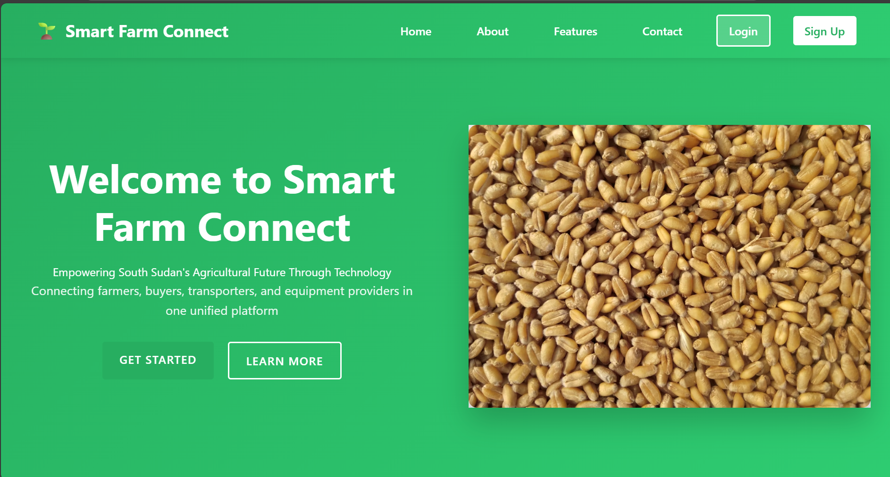

# Smart Farm Connect

A comprehensive platform designed for South Sudan's agricultural ecosystem, bridging the gap between Farmers, Buyers, and Transporters.

## Project Structure

This project consists of:

- **Frontend**: React application with TypeScript and Tailwind CSS
- **Backend**: Django REST API with multiple apps for different features

## Setup Instructions

### Backend Setup

1. Create a virtual environment:
   \`\`\`
   python -m venv venv
   source venv/bin/activate  # On Windows: venv\Scripts\activate
   \`\`\`

2. Install dependencies:
   \`\`\`
   pip install django djangorestframework django-cors-headers pillow
   \`\`\`

3. Navigate to the backend directory and run migrations:
   \`\`\`
   cd backend
   python manage.py makemigrations
   python manage.py migrate
   \`\`\`

4. Create a superuser:
   \`\`\`
   python manage.py createsuperuser
   \`\`\`

5. Run the development server:
   \`\`\`
   python manage.py runserver
   \`\`\`

### Frontend Setup

1. Navigate to the frontend directory:
   \`\`\`
   cd frontend
   \`\`\`

2. Install dependencies:
   \`\`\`
   npm install
   \`\`\`

3. Start the development server:
   \`\`\`
   npm start
   \`\`\`

## Features

- User authentication with role-based access (Farmer, Buyer, Transporter, Equipment Seller)
- Weather information for farmers
- Marketplace for agricultural products
- Equipment rental service
- Transportation coordination
- Dashboard for each user type

## API Endpoints

- `/api/auth/` - Authentication endpoints
- `/api/products/` - Product management
- `/api/equipment/` - Equipment rental
- `/api/transports/` - Transportation services
- `/api/weather/` - Weather information

## Technologies Used

- **Frontend**: React, TypeScript, Tailwind CSS, Axios
- **Backend**: Django, Django REST Framework
- **Database**: SQLite (development), PostgreSQL (production)
- **Authentication**: Token-based authentication

This is the link to my github account
    https://github.com/KurMalual/final-capstone.git

## License

This project is licensed under the MIT License.
